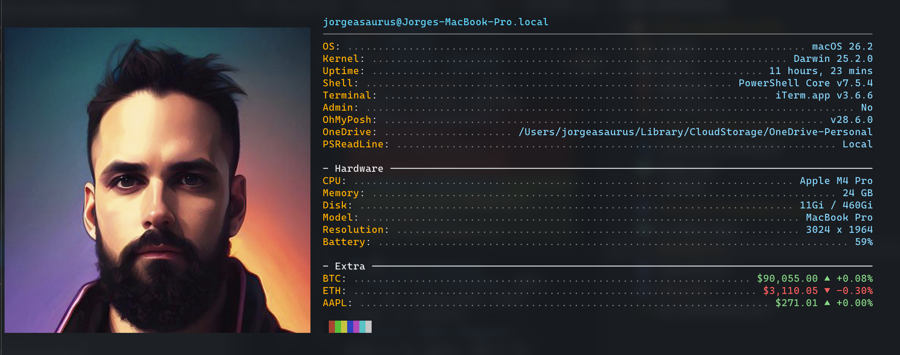

# 🎨 PowerShell Profile

A cross-platform, feature-rich PowerShell profile that brings a beautiful terminal experience to Windows and macOS with Oh My Posh theming, system information display, auto-updates, and powerful utility functions.

## ✨ Features

### 🎯 Core Features
- **Cross-platform** - Works on Windows and macOS
- **Auto-updating** - Automatically checks for and installs updates from GitHub
- **Oh My Posh theming** - Beautiful Powerlevel10k-inspired prompt
- **System neofetch** - Displays system information on startup with ASCII art
- **Module management** - Fast module installation and update utilities
- **Price tracking** - Live cryptocurrency (BTC, ETH) and stock price display

### 🚀 Utility Functions
- **Navigation**: Enhanced `cd`, directory shortcuts (`docs`, `dtop`)
- **File Operations**: `touch`, `ff` (find file), `grep` alternatives
- **Git Integration**: Quick status, commits, and repository management
- **System Tools**: `reload-profile`, `uptime`, `sysinfo`, `pkill`
- **PowerShell Updates**: `Update-PowerShell` with automatic version checking
- **Module Management**: `Update-Modules`, `Install-LatestModule`, `Get-InstalledModuleFast`

### 📊 Extra Features
- **Live Price Display**: BTC, ETH, and customizable stock ticker in neofetch
- **Color-coded changes**: Green ▲ for gains, Red ▼ for losses
- **Real-time APIs**: CoinGecko for crypto, Yahoo Finance for stocks

## ⚡ Installation

### One-Line Install (Recommended)

Run this command in an **elevated** PowerShell window:

```powershell
irm "https://github.com/jorgeasaurus/powershell-profile/raw/main/setup.ps1" | iex
```

This will:
1. Install Oh My Posh
2. Download and install Nerd Fonts
3. Install Terminal-Icons module
4. Set up the PowerShell profile

### Manual Installation

1. Clone this repository:
```powershell
git clone https://github.com/jorgeasaurus/powershell-profile.git
cd powershell-profile
```

2. Run the setup script:
```powershell
.\setup.ps1
```

3. Install a Nerd Font (see below)

## 🛠️ Font Installation

The profile requires a Nerd Font to display icons correctly.

### Option 1: Automatic Font Download
The setup script downloads `cove.zip` containing the Caskaydia Cove Nerd Font:
1. Extract `cove.zip`
2. Install the fonts (double-click each font file)

### Option 2: Oh My Posh Font Installer
```powershell
oh-my-posh font install
```

Select a font using arrow keys and press Enter. Popular choices:
- **CascadiaCode** - Microsoft's coding font
- **FiraCode** - Popular with ligature support
- **JetBrainsMono** - Clean and modern
- **Meslo** - Classic terminal font

### Option 3: Manual Download
Download from [Nerd Fonts](https://www.nerdfonts.com/font-downloads)

## 🎨 Profile Output

When you open a new PowerShell session, you'll see (this is my version, yours will show your specific info):



## 📝 Configuration

### Customize Your Stock Ticker

Edit line 51 in `Microsoft.PowerShell_profile.ps1`:

```powershell
$UserStockSymbol = "AAPL"  # Change to your preferred stock (TSLA, MSFT, GOOGL, etc.)
```

### Update Interval

Change how often the profile checks for updates (line 7):

```powershell
$updateInterval = 7  # Days between update checks (-1 to always check)
```

### Theme Customization

Change the Oh My Posh theme (line 48):

```powershell
$OhMyPoshTheme = "https://raw.githubusercontent.com/JanDeDobbeleer/oh-my-posh/main/themes/powerlevel10k_rainbow.omp.json"
```

Browse themes at: https://ohmyposh.dev/docs/themes

## 🔧 Usage

### Module Management

```powershell
# Update all installed modules
Update-Modules

# Update specific module
Update-Modules -Name Pester

# Reinstall module with latest version (removes all old versions)
Install-LatestModule -Name Pester

# Reinstall all modules in user directory
ls ~/.local/share/powershell/Modules | Install-LatestModule -Force

# Get installed modules fast (caches results)
Get-InstalledModuleFast
```

### Price Tracking

```powershell
# Show live price snapshot
Show-PriceSnapshot

# Get crypto prices
Get-CryptoPrice -Symbol BTC, ETH, SOL

# Get stock prices
Get-StockPrice -Symbol AAPL, TSLA, MSFT

# Change default stock
Show-PriceSnapshot -StockSymbol TSLA
```

### System Information

```powershell
# Show neofetch display
Show-SystemNeofetch

# Get system info object
Get-SystemInfo

# Show uptime
uptime

# System information shortcut
sysinfo
```

### Navigation

```powershell
# Quick directory navigation
docs        # ~/Documents
dtop        # ~/Desktop
onedrive    # ~/OneDrive

# Find files
ff "*.ps1"  # Find all PowerShell files

# Enhanced cd with auto-completion
cd projects
```

### Git Shortcuts

```powershell
# Git status
gs

# Git add all and commit
gcom "commit message"

# Git log pretty
glog

# Clone and navigate into repo
gclon https://github.com/user/repo
```

## 🎯 Key Functions

### Profile Management
- `Edit-Profile` - Create user-specific profile (won't be overwritten)
- `Update-Profile` - Manually check for profile updates
- `reload-profile` - Reload the current profile

### PowerShell Management
- `Update-PowerShell` - Check and install latest PowerShell version
- `Get-InstalledModuleFast` - Fast module enumeration (2-3x faster)

### System Utilities
- `admin` - Open new PowerShell window as administrator (Windows)
- `uptime` - Show system uptime
- `pkill` - Kill processes by name
- `grep` - Search file contents
- `touch` - Create new file(s)
- `ff` - Find files by pattern

### Cleanup
- `Clear-Cache` - Clear system caches (Windows/Mac specific)
- `Clear-WindowsCache` - Clear Windows temp files, prefetch, etc.
- `Clear-MacCache` - Clear macOS caches

## 🔄 Auto-Update System

The profile automatically checks for updates based on `$updateInterval`:

1. **Checks GitHub** for the latest profile version
2. **Compares hashes** to detect changes
3. **Downloads** and installs if update available
4. **Preserves** your custom `profile.ps1` settings

To disable auto-updates, set debug mode:
```powershell
$debug = $true  # Line 4 in profile
```

## 🎨 Customization

### IMPORTANT: Do Not Modify Main Profile

**Do not edit `Microsoft.PowerShell_profile.ps1`** - it's automatically updated from GitHub and changes will be overwritten.

### Create Personal Profile

Run `Edit-Profile` to create `profile.ps1` in your PowerShell directory for personal customizations:

```powershell
Edit-Profile
```

This file is loaded after the main profile and won't be overwritten by updates.

### Custom Aliases

Add to your `profile.ps1`:

```powershell
# Custom aliases
Set-Alias -Name vim -Value nvim
Set-Alias -Name ll -Value Get-ChildItem

# Custom functions
function myfunction {
    Write-Host "Hello from my custom function!"
}
```

## 🧪 Development

### Testing Profile Changes

Set debug mode to prevent auto-updates during development:

```powershell
# Edit line 4
$debug = $true
```

Test the profile without loading it:

```powershell
pwsh -noprofile -File ./Microsoft.PowerShell_profile.ps1
```

### Copy Profile Locally

```powershell
.\setprofile.ps1
```

Reload profile in current session:

```powershell
. $PROFILE
```

## 📋 Requirements

- **PowerShell 7.0+** (PowerShell Core)
- **Windows 10/11** or **macOS 10.15+**
- **Internet connection** for auto-updates and price tracking
- **Nerd Font** for icon display

### Optional Dependencies
- **Git** - For git shortcuts and repository management
- **winget** (Windows) or **Homebrew** (macOS) - For PowerShell updates

## 🌐 API Services Used

- **CoinGecko API** - Free cryptocurrency price data
- **Yahoo Finance API** - Free stock price data
- **GitHub API** - PowerShell version checking

All APIs are free and require no authentication.

## 🔍 Architecture

### Auto-Update Flow
```
Start PowerShell
    ↓
Check if update due ($updateInterval)
    ↓
Fetch latest from GitHub
    ↓
Compare file hashes
    ↓
Download if different
    ↓
Reload profile
```

### Platform Branching
Uses `$IsWindows` / `$IsMacOS` automatic variables for platform-specific code:
- Windows: `Invoke-WindowsPowerShellUpgrade`, `Clear-WindowsCache`
- macOS: `Invoke-MacPowerShellUpgrade`, `Clear-MacCache`
- Cross-platform: `Clear-Cache`, `Update-PowerShell` (wrappers)

### Module Fast Loading
`Get-InstalledModuleFast` caches module information to speed up:
- Module enumeration (2-3x faster)
- Update checks
- Version comparisons

## 🤝 Contributing

Contributions welcome! Please:

1. Fork the repository
2. Create a feature branch
3. Test thoroughly on both Windows and macOS if possible
4. Follow PowerShell best practices:
   - Use approved verbs (`Get-`, `Set-`, `Update-`, etc.)
   - Include comment-based help
   - Use `[CmdletBinding()]` for advanced functions
   - Handle errors with try/catch

## 📄 License

MIT License - Feel free to use and modify!

## 🙏 Credits

- **Oh My Posh** - [JanDeDobbeleer/oh-my-posh](https://github.com/JanDeDobbeleer/oh-my-posh)
- **Terminal-Icons** - [devblackops/Terminal-Icons](https://github.com/devblackops/Terminal-Icons)
- **Nerd Fonts** - [ryanoasis/nerd-fonts](https://github.com/ryanoasis/nerd-fonts)
- **PowerShell** - [PowerShell/PowerShell](https://github.com/PowerShell/PowerShell)

## 🐛 Issues & Support

Report issues at: https://github.com/jorgeasaurus/powershell-profile/issues

For questions about:
- **Oh My Posh** - See [Oh My Posh Docs](https://ohmyposh.dev)
- **PowerShell** - See [PowerShell Docs](https://docs.microsoft.com/powershell)

---

**Enjoy your beautiful PowerShell experience!** 🚀✨
